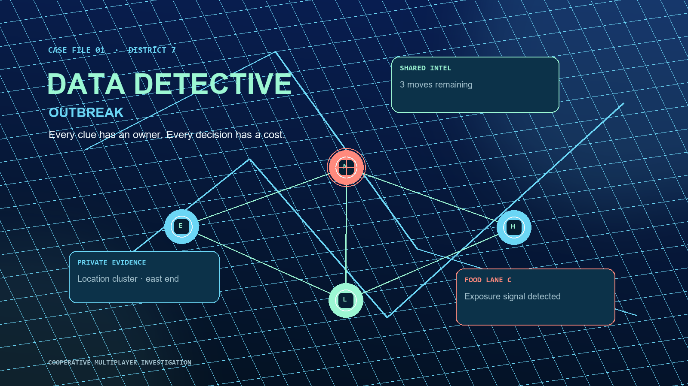

# Data Detective: Outbreak

Data Detective: Outbreak is a cross-device cooperative investigation game. Two to four players join the same online room, choose distinct specialist roles, reveal private evidence, agree on limited investigation moves, and make one final containment decision together.

## How it works

1. One player hosts a case and shares the invite.
2. Teammates open the same public game link from their own devices, enter the room code, and choose different roles.
3. The team shares role-specific clues on one live intel board.
4. Everyone sees the same actions, working theory, final decision, and result in real time.

## Run locally

Serve this folder from any local web server, then open it in two independent browser profiles. The included Firebase configuration supports live rooms; use a separate device or browser profile for each player.

## Multiplayer verification

The room flow has been checked with two independent clients: hosting and joining a room, choosing different roles, starting a case, sharing evidence, saving a theory, taking actions, and submitting a shared final decision. Before contest submission, repeat that check on the public link with two separate devices.

## Technology

- Static HTML, CSS, and JavaScript
- Firebase Realtime Database for live room state
- Firebase Anonymous Authentication for guest players
- GitHub Pages for the public game URL

This is a fictional experience for collaborative problem-solving. It does not provide health guidance.
